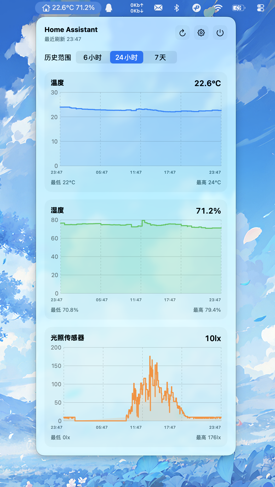

# HABar

一个基于 SwiftUI 的 macOS 菜单栏应用，用来连接 Home Assistant 并显示传感器信息。



## 功能

- 在菜单栏显示 1 到 3 个传感器当前值
- 点击菜单栏图标查看 1 到 4 个传感器历史图表
- 支持 `6小时`、`24小时`、`7天` 时间范围
- 支持为每个图表配置不同颜色
- 支持开机自启动

## 使用方式

1. 打开应用。
2. 在设置中填写 Home Assistant 地址和 Long-Lived Access Token。
3. 选择菜单栏要显示的传感器。
4. 选择卡片界面要显示的图表传感器。

## 构建

在项目目录执行：

```bash
env DEVELOPER_DIR=/Applications/Xcode-26.3.0.app/Contents/Developer xcodebuild -scheme HABar -derivedDataPath /tmp/HABarDerived build
```

构建产物示例：

```text
/tmp/HABarDerived/Build/Products/Debug/HABar.app
```

## 安装包

当前仓库里已经生成了一个 DMG：

```text
/Users/umi/Documents/HABar/HABar.dmg
```
